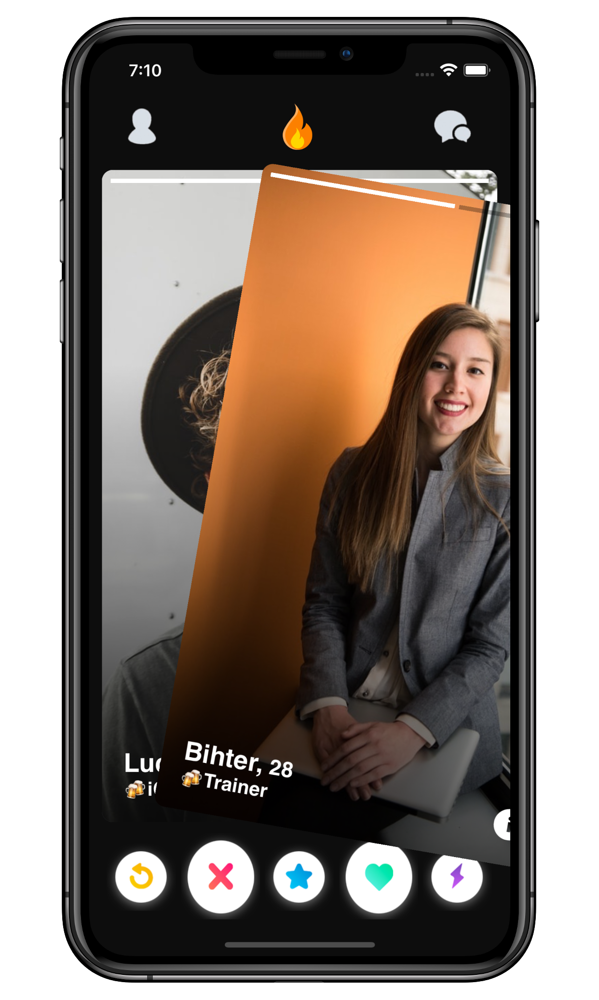
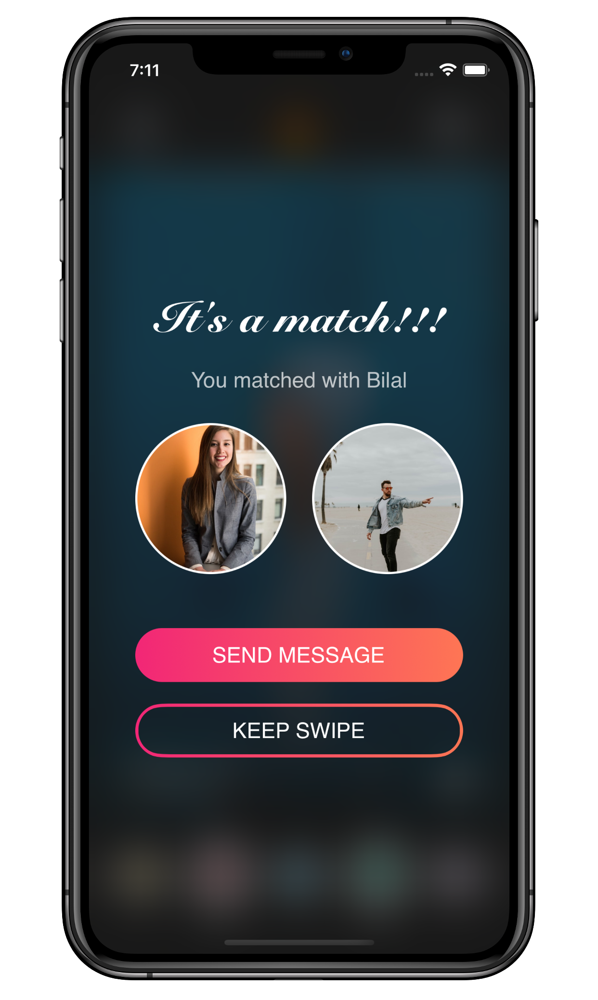
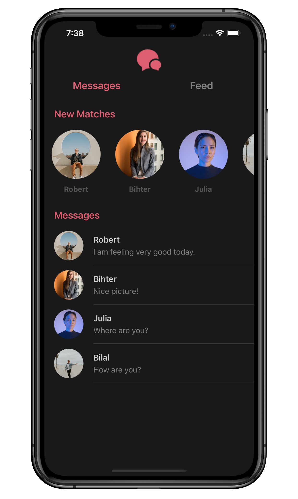
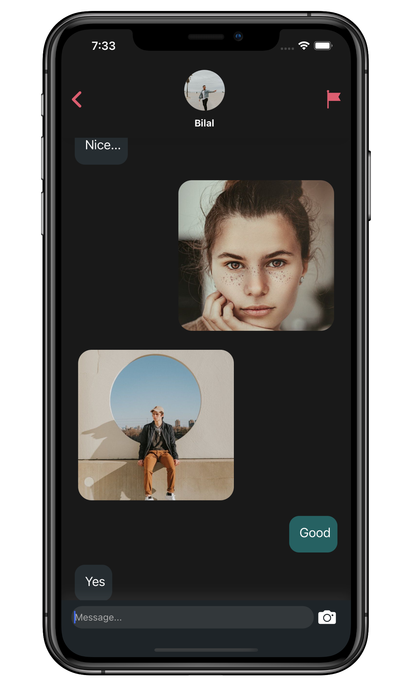

# Finder
<h2> <b> Finder  </b> </h2>
<h4> <b> Finder is actually clone application of Tinder. Finder has most of fundamental functions like login, sign up, update profile, age restrictions, liking people, become friends, send text and image messages. MVVM architecture is followed in Finder App and not used storyboards or xib. </b> </h4> 
 
<a href="https://www.linkedin.com/in/onurustunel/"> LinkedIn </a> 

 

App Screen 

 

 

 

 

